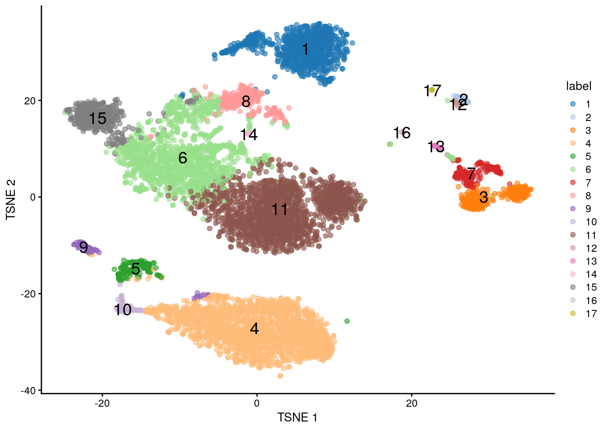
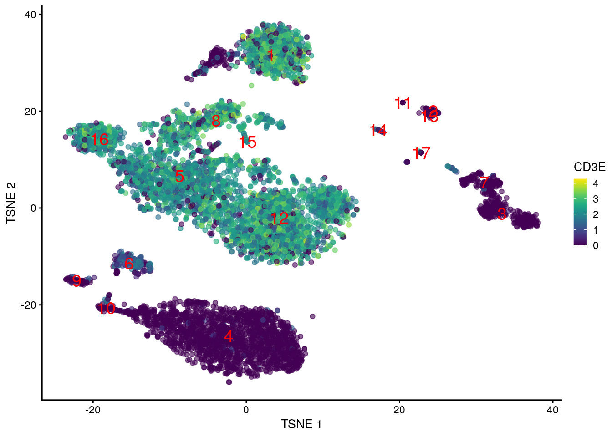
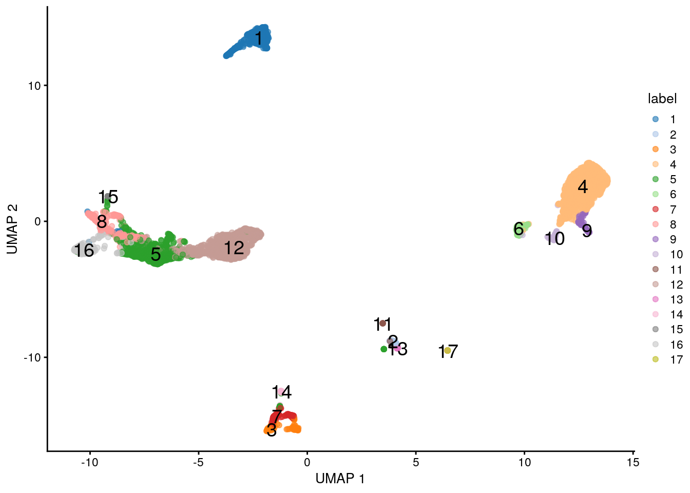
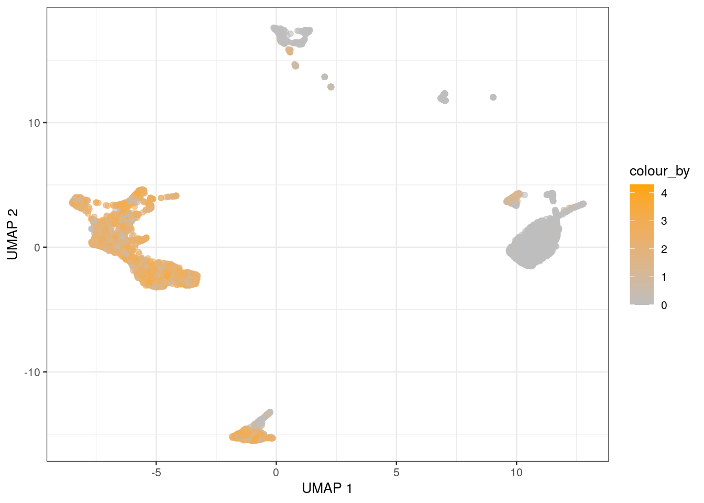
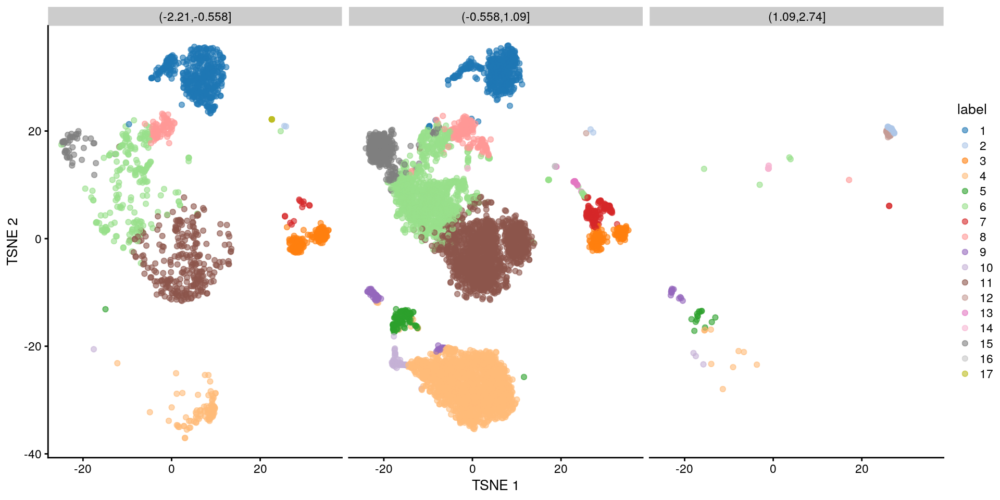

# Plotting reduced dimensions


```
## <script>
## document.addEventListener("click", function (event) {
##     if (event.target.classList.contains("rebook-collapse")) {
##         event.target.classList.toggle("active");
##         var content = event.target.nextElementSibling;
##         if (content.style.display === "block") {
##             content.style.display = "none";
##         } else {
##             content.style.display = "block";
##         }
##     }
## })
## </script>
## 
## <style>
## .rebook-collapse {
##   background-color: #eee;
##   color: #444;
##   cursor: pointer;
##   padding: 18px;
##   width: 100%;
##   border: none;
##   text-align: left;
##   outline: none;
##   font-size: 15px;
## }
## 
## .rebook-content {
##   padding: 0 18px;
##   display: none;
##   overflow: hidden;
##   background-color: #f1f1f1;
## }
## </style>
```

## Foreword 

When one thinks of single-cell data analysis, one thinks of $t$-SNEs.
(Or maybe UMAPs, for the younger folks.)
Indeed, hardly a single-cell paper comes out these days without a $t$-SNE or UMAP plot in it somewhere.
I would guess that their popularity stems from the entrancing illusion that a viewer is looking at "raw data",
unsullied by the authors' interpretation.
Indeed, I personally prefer $t$-SNEs as - with the right parameters - they can be made to look like histology images,
while UMAPs look more like the aftermath of blowing your nose.
But hey, to each their own.

## Setting up the data

Here we'll use one of the many PBMC datasets generated by 10X Genomics [@zheng2017massively].
One can only imagine how many times these PBMCs have been re-analyzed,
surely there's nothing we don't know about these cells anymore.


```r
library(DropletTestFiles)
fpath <- getTestFile(file.path("tenx-3.0.0-pbmc_10k_protein_v3", 
    "1.0.0/filtered.tar.gz"), prefix=TRUE)
tmp <- tempfile()
untar(fpath, exdir=tmp)

library(DropletUtils)
sce <- read10xCounts(file.path(tmp, "filtered_feature_bc_matrix"))
sce <- splitAltExps(sce, rowData(sce)$Type) # splitting off the ADTs.
sce
```

```
## class: SingleCellExperiment 
## dim: 33538 7865 
## metadata(1): Samples
## assays(1): counts
## rownames(33538): ENSG00000243485 ENSG00000237613 ... ENSG00000277475
##   ENSG00000268674
## rowData names(3): ID Symbol Type
## colnames: NULL
## colData names(2): Sample Barcode
## reducedDimNames(0):
## altExpNames(1): Antibody Capture
```

We slap together a quick-and-dirty analysis with some of the usual packages [@amezquita2020orchestrating].
Normally we would make some more diagnostic plots for each of these steps,
but it would not do to distract from the star of the show in this chapter.


```r
library(scater)
library(scran)
library(scuttle)
library(bluster)

# Quality control on the mitochondrial content:
qcstats <- perCellQCMetrics(sce, subsets=list(Mito=grep("^MT-", rowData(sce)$Symbol)))
discard <- isOutlier(qcstats$subsets_Mito_percent, type="higher")
sce <- sce[,!discard]
summary(discard)
```

```
##    Mode   FALSE    TRUE 
## logical    7569     296
```

```r
# Normalization and feature selection:
sce <- logNormCounts(sce)
dec <- modelGeneVarByPoisson(sce)
hvgs <- getTopHVGs(dec, n=4000)

# PCA and some clustering:
set.seed(117)
sce <- runPCA(sce, subset_row=hvgs)
colLabels(sce) <- clusterRows(reducedDim(sce), NNGraphParam())

# Creating those sweet, sweet t-SNEs.
set.seed(118)
sce <- runTSNE(sce, dimred="PCA")
sce <- runUMAP(sce, dimred="PCA")
sce
```

```
## class: SingleCellExperiment 
## dim: 33538 7569 
## metadata(1): Samples
## assays(2): counts logcounts
## rownames(33538): ENSG00000243485 ENSG00000237613 ... ENSG00000277475
##   ENSG00000268674
## rowData names(3): ID Symbol Type
## colnames: NULL
## colData names(4): Sample Barcode sizeFactor label
## reducedDimNames(3): PCA TSNE UMAP
## altExpNames(1): Antibody Capture
```

We can see that the dimensionality reduction results are tucked away in the `reducedDims()` of the `sce` object.
If you want to get in on the action, you can pull out the reduced dimensions yourself for plotting:


```r
head(reducedDim(sce, "TSNE"))
```

```
##         [,1]   [,2]
## [1,]   2.695 -25.15
## [2,]   3.495 -23.44
## [3,]   1.222 -20.84
## [4,]   5.914  26.88
## [5,]   4.174  31.35
## [6,] -11.596 -26.63
```

## Visualizing with *[scater](https://bioconductor.org/packages/3.12/scater)*

We'll start with the visualizations from the *[scater](https://bioconductor.org/packages/3.12/scater)* package [@mccarthy2017scater].
The `plotTSNE()` function creates `ggplot` objects that can be coloured by label:


```r
plotTSNE(sce, colour_by="label", text_by="label")
```

<div class="figure">

<p class="caption">(\#fig:scater-tsne-color-label)$t$-SNE coloured by the cluster label.</p>
</div>

... or by the expression of a particular gene, using the neon 80's-throwback color scheme that is *[viridis](https://CRAN.R-project.org/package=viridis)*:


```r
plotTSNE(sce, colour_by="CD3E", swap_rownames="Symbol", 
    text_by="label", text_colour="red")
```

<div class="figure">

<p class="caption">(\#fig:scater-tsne-color-cd3)$t$-SNE coloured by the expression of _CD3_.</p>
</div>

This function and the equivalent `plotUMAP()` use the same `plotReducedDim()` function under the hood.
We can generate plots for any dimensionality reduction result in `sce` by calling `plotReducedDim()` directly:


```r
plotReducedDim(sce, "UMAP", colour_by="label", text_by="label")
```

<div class="figure">

<p class="caption">(\#fig:scater-umap-color-label)UMAP coloured by the cluster label.</p>
</div>

And of course, this is all `ggplot`-based, so you can just add on your own layers to customize the aesthetics.
Don't like viridis?
(Does anybody? Ho ho ho.)
You can swap it out with a color scale of your choice using the relevant *[ggplot2](https://CRAN.R-project.org/package=ggplot2)* functions:


```r
plotUMAP(sce, colour_by="CD3E", swap_rownames="Symbol") +
    scale_color_gradient(low="grey", high="orange")
```

<div class="figure">

<p class="caption">(\#fig:scater-umap-color-cd3)UMAP coloured by the expression of _CD3_.</p>
</div>

In fact, you can tell `plotTSNE()` and `plotUMAP()` to carry over any `colData()` field from the `SingleCellExperiment`.
These fields are inserted into the `data.frame` and can be used in any *[ggplot2](https://CRAN.R-project.org/package=ggplot2)*-compatible function:


```r
set.seed(119)
sce$category <- cut(log(sizeFactors(sce)), 3)
plotTSNE(sce, colour_by="label", other_fields="category") +
    facet_wrap('category')
```

<div class="figure">

<p class="caption">(\#fig:scater-tsne-color-cd3-facet)$t$-SNE coloured by the cluster identity and faceted by the log-size factor.</p>
</div>

I could go on, but I won't.

## Session information {-}

<button class="rebook-collapse">View session info</button>
<div class="rebook-content">
```
R version 4.0.0 Patched (2020-05-01 r78341)
Platform: x86_64-pc-linux-gnu (64-bit)
Running under: Ubuntu 18.04.5 LTS

Matrix products: default
BLAS:   /home/luna/Software/R/R-4-0-branch-dev/lib/libRblas.so
LAPACK: /home/luna/Software/R/R-4-0-branch-dev/lib/libRlapack.so

locale:
 [1] LC_CTYPE=en_US.UTF-8       LC_NUMERIC=C              
 [3] LC_TIME=en_US.UTF-8        LC_COLLATE=en_US.UTF-8    
 [5] LC_MONETARY=en_US.UTF-8    LC_MESSAGES=en_US.UTF-8   
 [7] LC_PAPER=en_US.UTF-8       LC_NAME=C                 
 [9] LC_ADDRESS=C               LC_TELEPHONE=C            
[11] LC_MEASUREMENT=en_US.UTF-8 LC_IDENTIFICATION=C       

attached base packages:
[1] parallel  stats4    stats     graphics  grDevices utils     datasets 
[8] methods   base     

other attached packages:
 [1] bluster_0.99.1              scuttle_0.99.13            
 [3] scran_1.17.15               scater_1.17.4              
 [5] ggplot2_3.3.2               DropletUtils_1.9.10        
 [7] SingleCellExperiment_1.11.6 SummarizedExperiment_1.19.6
 [9] DelayedArray_0.15.7         matrixStats_0.56.0         
[11] Matrix_1.2-18               Biobase_2.49.0             
[13] GenomicRanges_1.41.6        GenomeInfoDb_1.25.10       
[15] IRanges_2.23.10             S4Vectors_0.27.12          
[17] BiocGenerics_0.35.4         DropletTestFiles_0.99.0    
[19] BiocStyle_2.17.0           

loaded via a namespace (and not attached):
  [1] Rtsne_0.15                    ggbeeswarm_0.6.0             
  [3] colorspace_1.4-1              ellipsis_0.3.1               
  [5] XVector_0.29.3                BiocNeighbors_1.7.0          
  [7] farver_2.0.3                  bit64_4.0.2                  
  [9] RSpectra_0.16-0               interactiveDisplayBase_1.27.5
 [11] AnnotationDbi_1.51.3          codetools_0.2-16             
 [13] R.methodsS3_1.8.0             knitr_1.29                   
 [15] dbplyr_1.4.4                  R.oo_1.23.0                  
 [17] rebook_0.99.5                 graph_1.67.1                 
 [19] uwot_0.1.8                    shiny_1.5.0                  
 [21] HDF5Array_1.17.3              BiocManager_1.30.10          
 [23] compiler_4.0.0                httr_1.4.2                   
 [25] dqrng_0.2.1                   assertthat_0.2.1             
 [27] fastmap_1.0.1                 limma_3.45.10                
 [29] later_1.1.0.1                 BiocSingular_1.5.0           
 [31] htmltools_0.5.0               tools_4.0.0                  
 [33] rsvd_1.0.3                    igraph_1.2.5                 
 [35] gtable_0.3.0                  glue_1.4.1                   
 [37] GenomeInfoDbData_1.2.3        dplyr_1.0.2                  
 [39] rappdirs_0.3.1                Rcpp_1.0.5                   
 [41] vctrs_0.3.2                   rhdf5filters_1.1.2           
 [43] ExperimentHub_1.15.2          DelayedMatrixStats_1.11.1    
 [45] xfun_0.16                     stringr_1.4.0                
 [47] ps_1.3.4                      mime_0.9                     
 [49] lifecycle_0.2.0               irlba_2.3.3                  
 [51] statmod_1.4.34                XML_3.99-0.5                 
 [53] AnnotationHub_2.21.3          edgeR_3.31.4                 
 [55] zlibbioc_1.35.0               scales_1.1.1                 
 [57] promises_1.1.1                rhdf5_2.33.7                 
 [59] yaml_2.2.1                    curl_4.3                     
 [61] memoise_1.1.0                 gridExtra_2.3                
 [63] stringi_1.4.6                 RSQLite_2.2.0                
 [65] highr_0.8                     BiocVersion_3.12.0           
 [67] filelock_1.0.2                BiocParallel_1.23.2          
 [69] rlang_0.4.7                   pkgconfig_2.0.3              
 [71] bitops_1.0-6                  evaluate_0.14                
 [73] lattice_0.20-41               purrr_0.3.4                  
 [75] Rhdf5lib_1.11.3               labeling_0.3                 
 [77] CodeDepends_0.6.5             cowplot_1.0.0                
 [79] bit_4.0.4                     processx_3.4.3               
 [81] tidyselect_1.1.0              RcppAnnoy_0.0.16             
 [83] magrittr_1.5                  bookdown_0.20                
 [85] R6_2.4.1                      generics_0.0.2               
 [87] DBI_1.1.0                     pillar_1.4.6                 
 [89] withr_2.2.0                   RCurl_1.98-1.2               
 [91] tibble_3.0.3                  crayon_1.3.4                 
 [93] BiocFileCache_1.13.1          rmarkdown_2.3                
 [95] viridis_0.5.1                 locfit_1.5-9.4               
 [97] grid_4.0.0                    blob_1.2.1                   
 [99] callr_3.4.3                   digest_0.6.25                
[101] xtable_1.8-4                  httpuv_1.5.4                 
[103] R.utils_2.9.2                 munsell_0.5.0                
[105] beeswarm_0.2.3                viridisLite_0.3.0            
[107] vipor_0.4.5                  
```
</div>
